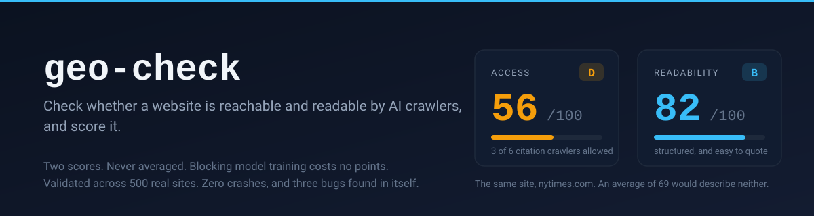

<h1 align="center">
  
</h1>

<p align="center">
  <a href="https://github.com/Vascobranco2509/geo-check/actions/workflows/ci.yml"></a>
  
  
  
  
</p>

<p align="center">
  <b>Check whether a website is reachable and readable by AI crawlers, and score it.</b><br>
  Two scores, never averaged. Blocking model training costs no points.
</p>

> Not on PyPI yet. Clone and `pip install -e .` until it is.

## What this is

A Claude Code skill, and a command line tool, that audits one domain for two
things: whether AI systems can reach it, and whether they can make sense of it
once they have.

You give it a domain. It reads `robots.txt`, the sitemap, `llms.txt` and five
pages sampled from that sitemap, then returns two scores from 0 to 100 with a
letter each, the exact robots.txt lines to paste if something is blocked, and
the rule that produced every verdict so you can check the work.

```bash
geo-check example.com
```

It runs on your machine, needs open network access, and calls no model. The
scoring path is deterministic: two runs against an unchanged site give the same
answer, and every response can be recorded and replayed.

## What GEO is, and why it matters

Generative Engine Optimization. The question is no longer only whether Google
lists you, it is whether ChatGPT, Claude, Perplexity and AI Overviews can find
you, read you, and quote you.

Most advice treats AI bots as one thing. They are not, and the confusion is
expensive. OpenAI alone runs three crawlers that do different jobs:

| Crawler | What it does | Blocking it costs you |
| --- | --- | --- |
| `GPTBot` | Collects pages for model training | Nothing in ChatGPT results |
| `OAI-SearchBot` | Decides whether ChatGPT can cite you | Your place in ChatGPT results, entirely |
| `ChatGPT-User` | Fetches a page someone asked about | Nothing, it is documented as ignoring robots.txt |

Those first two sit one line apart in a `robots.txt` file. Anthropic, Perplexity,
Google and Apple all split their crawlers the same way.

Some sites block the first on purpose and say so in public. Others opt out of
training and remove themselves from ChatGPT at the same time without meaning to,
and from outside a robots.txt file you cannot tell which is which. What you can
tell is exactly which lines are there and what each one costs, which is what this
prints.

## What it tells you

```
geo-check 0.1.0   nytimes.com
https://www.nytimes.com/   5 pages sampled

  ACCESS        56/100  D
  READABILITY   82.5/100  B

  Training posture: partial (3 of 14 allowed)
  Informational only. Blocking model training is a business decision and
  costs no points here.

------------------------------------------------------------------------
CITATION CRAWLERS   3 of 6 allowed
  allowed  Googlebot, Bingbot, Applebot
  blocked  OAI-SearchBot, Claude-SearchBot, PerplexityBot
           because of  User-agent: Claude-SearchBot | Disallow: /
           because of  User-agent: OAI-SearchBot | Disallow: /
           because of  User-agent: PerplexityBot | Disallow: /

USER FETCH CRAWLERS   1 of 5 allowed
  allowed  MistralAI-User
  blocked  ChatGPT-User, Claude-User, Perplexity-User, Meta-ExternalFetcher
           because of  User-agent: ChatGPT-User | Disallow: /
           because of  User-agent: Claude-User | Disallow: /
           because of  User-agent: Meta-ExternalFetcher | Disallow: /
           because of  User-agent: Perplexity-User | Disallow: /

------------------------------------------------------------------------
WHAT TO CHANGE FIRST

  Add these lines to https://www.nytimes.com/robots.txt:

      User-agent: OAI-SearchBot
      Allow: /
      
      User-agent: Claude-SearchBot
      Allow: /
      
      User-agent: PerplexityBot
      Allow: /
      
      User-agent: Claude-User
      Allow: /

  25 points  Citation crawlers allowed
            Allow the citation crawlers in robots.txt. Each group sits alongside whatever Disallow rules are already there, and none of them opens the site to model training.

  [ ... four more fixes, then every check with its evidence, the full
        crawler table, and what this tool cannot see ]
```

The New York Times is a deliberate configuration rather than an accident. Google,
Bing and Apple are let in, OpenAI, Anthropic and Perplexity are shut out by name.
The tool reads that correctly and does not call it a mistake. It tells you what
is true and leaves the judgement to you.

That run, and the `excalidraw.com` one further down, both replay from fixtures
committed to this repository, so you can reproduce them exactly.

## What makes this one different

**Two scores, never averaged.** `excalidraw.com` scores 100 on Access and 32 on
Readability. It is wide open to every crawler and unreadable by all of them. An
average of 66 would describe nothing true about that site and would hide the one
thing worth acting on, so the two never collapse into one figure.

**Training crawlers are worth zero points, on purpose.** Blocking model training
is a legitimate business decision, not a mistake. A newspaper protecting its
archive has done nothing wrong, and a tool that deducts points for it is not
measuring, it is lobbying. Training appears as one informational line and never
touches either score.

**Nothing is scored by a model.** No LLM sits in the scoring path. Every point
comes from a rule you can read in [docs/RUBRIC.md](docs/RUBRIC.md) and trace to
the line of `robots.txt` or markup that earned it, so the same site scores the
same twice and a score you disagree with is an argument you can have.

**Validated against 500 real sites, and the validation found bugs here first.**
408 scored, zero crashes, and no abort without a reason. Of the 92 that did not
score, 64 refused an automated client on purpose, 20 were unreachable from here
and may answer fine from elsewhere, and 8 are gone. Then every `robots.txt` was
read three ways and compared per agent, 9600 verdicts, agreeing 100 percent with
an independent reader written from RFC 9309.

That is the easy half. The half that counts is the 182 block verdicts traced by
hand to the `robots.txt` group that produced each one, because three
implementations agreeing proves consistency and not correctness.

It caught three real defects in this tool before anyone else could:

| Defect | What it would have done |
| --- | --- |
| User agents matched by substring | A site writing `User-agent: bot` would have silently blocked six citation crawlers at once |
| Groups declaring the same agent not merged | A site that contradicts itself got the first rule instead of the merge RFC 9309 requires |
| A bare `Crawl-delay` closing nothing | One site's `CCBot` inherited a `Disallow` aimed at `AhrefsBot` |

The 208 MB of recordings behind that are too large to ship, so
[data/corpus_manifest.csv](data/corpus_manifest.csv) carries the SHA-256 of every
`robots.txt` as it was read, all 500 rows, dated. To check them against the live
web:

```bash
python scripts/verify_manifest.py --sample 25
```

The evidence, and what it does not prove, is in
[docs/VALIDATION.md](docs/VALIDATION.md).

## Install

```bash
pip install -e .
```

Python 3.10 or newer, and open network access. It does not run inside sandboxes
that only reach an allowlist of domains.

## Use

```bash
geo-check example.com
```

```bash
geo-check example.com --pages 10 --json report.json --output report.md
```

The JSON is the real result. The markdown report and the terminal output are
both rendered from it, so the three can never disagree about the same run.

## The two scores in full

**Access** is whether AI systems can reach the site at all. Citation crawlers
allowed (50), user fetch crawlers allowed (20), sampled pages reachable without
a login wall (15), sitemap declared and reachable (10), no noindex (5).

**Readability** is whether an AI system can make sense of a page once it has it.
Content in the raw HTML without JavaScript (30), valid JSON-LD (20), heading
structure (15), title and meta description (10), author and dates (10),
canonical (5), llms.txt (5), answer shaped content (5).

Grades: 90 and above A, 75 to 89 B, 60 to 74 C, 40 to 59 D, below 40 F.

Three critical failures cap the Access score. All citation crawlers blocked caps
it at 20. A blanket `Disallow: /` caps it at 10. A homepage that does not return
200 aborts the run, because there is nothing honest to score.

The full rubric, with the reasoning and the two weaknesses it still has, is in
[docs/RUBRIC.md](docs/RUBRIC.md).

## How accurate is it

Two things are measured and published rather than claimed.

**A golden set of thirty hard sites.** Sites with no robots.txt, with a homepage
served at `/robots.txt`, with blanket blocks, with blanket blocks that name
exceptions, with wildcards, with Cloudflare generated files, with nested sitemap
indexes, and four different ways for a run to abort. Every expectation in
[data/golden_30.yaml](data/golden_30.yaml) was traced by hand to the robots.txt
group that produced it. These require 100 percent.

**An accuracy run across the corpus.** Every robots.txt read three ways and
compared per agent, 9600 verdicts: the tool, the Python standard library, and a
literal reader written from RFC 9309 sharing no code with either. The tool and
the literal reader agree on 100 percent. The standard library disagrees four
times, every one on a site with a group named `Fetch` that it applies to
`Meta-ExternalFetcher` by substring.

Three implementations agreeing proves consistency, not correctness. So the 182
block verdicts were each traced by hand to the robots.txt group that produced
them, and that is the number worth trusting. The comparison is in
[data/accuracy_report.json](data/accuracy_report.json).

`pytest` runs 161 tests offline in about fifteen seconds. It never touches the
network.

## What this does not do

It does not detect blocking at the CDN or WAF level. Your robots.txt can say yes
while Cloudflare returns 403 to AI crawlers, and this tool will not see it. The
one place it surfaces is a run that aborts on the homepage, and 64 of the 500
were refused there outright.

It does not render JavaScript. The raw HTML check measures how much readable text
arrives in the initial response and how much of that response is script. The
thresholds were measured across 22 live pages rather than chosen, and both the
numbers and the script that produced them are in the repository, at
[data/js_calibration.csv](data/js_calibration.csv) and
[scripts/calibrate_js_threshold.py](scripts/calibrate_js_threshold.py).

Answer shaped content is detected structurally. The check can see that a page has
an ordered list of five steps and that the prose is broken into sections. It
cannot see whether either is any good.

It does not measure whether AI assistants actually cite you. That is a different
and much larger problem.

## The crawler list

Every user agent, its vendor, its bucket, whether the vendor documents it as
honouring robots.txt, and a link to the official documentation lives in
[src/geo_check/data/agents.json](src/geo_check/data/agents.json). Every entry was
checked against vendor documentation on 2026-08-30.

Three of the five on demand fetchers say plainly that they ignore robots.txt.
`Perplexity-User` and `ChatGPT-User` are documented that way by Perplexity and
OpenAI themselves, and `Meta-ExternalFetcher` may bypass it for user initiated
requests. A `Disallow` aimed at those changes nothing, so the report says so
instead of pretending the block worked, and they are left out of the robots.txt
block it offers you.

The list moves. Pull requests adding or correcting entries, with the vendor
documentation URL, are the most useful contribution you can make.

## Contributing

Adding a check is one file in `src/geo_check/checks/` and one line in the
registry. The most useful contribution is a correction to the crawler list, with
the vendor's own documentation URL.

```bash
pip install -e ".[dev]" && pytest
```

[CONTRIBUTING.md](CONTRIBUTING.md) has the rest: how a check is written, how the
golden set works, how to record fixtures, and why the recorder is deliberately
slow. [SECURITY.md](SECURITY.md) carries one known and unfixed issue worth
reading before you pipe this tool's output into an agent.

## Licence

MIT.
